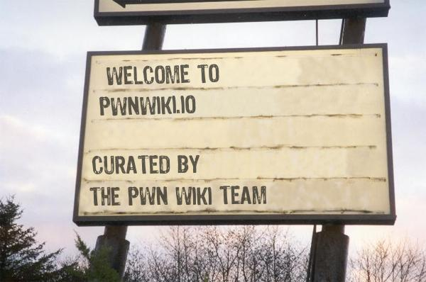

[Image Generated Here](http://www.addletters.com/pictures/restaurant-sign-generator/4729076.htm#.Um8oRyQeLuN)

### PostExploitation.com is a collection TTPs (tools, tactics, and procedures) for what to do after access has been gained.

- - - - - - 

### Live Online Copy:

You can find a copy of the project online at: http://mubix.github.io/post-exploitation-wiki/

### Offline Use:

  1. Clone the repository or pull the archive ([download zip](https://github.com/mubix/post-exploitation-wiki/archive/master.zip)) of the repo
  2. Open index.html
  3. Most modern browsers don't allow the access of local files from a locally loaded HTML file. On Windows you can use [Mongoose Tiny](http://cesanta.com/downloads.html) or [HFS](http://www.rejetto.com/hfs/) to host the files locally. On OSX and Linux `python -m SimpleHTTPServer` seems to work just fine.

#### Referenced tools can be found here: https://github.com/mubix/post-exploitation (If they aren't built into the OS)

- - - - - -
#### Submitting Content

We realize that everyone has their favorite commands they run. Is your go-to content not up here? Want to submit it? Either submit a pull request or if you don't want to spend the time becoming a Git Jedi, just visit our [Google Form](https://docs.google.com/forms/d/1N7-jRjnUXoz-UwB2h0du2IrskFJW6hBGs4YsTwvEncE/viewform). Thanks! 

- - - - - -
Curators:

  * [@mubix](https://twitter.com/mubix) [gimmick:TwitterFollow](@mubix)
  * [@WebBreacher](https://twitter.com/webbreacher) [gimmick:TwitterFollow](@WebBreacher)
  * [@tekwizz123](https://twitter.com/tekwizz123) [gimmick:TwitterFollow](@tekwizz123)
  * [@jakx_](https://twitter.com/jakx_) [gimmick:TwitterFollow](@jakx_)
  
If you would like to become a curator, please contact [mubix@hak5.org](mailto:mubix@hak5.org)

[gimmick:ForkMeOnGitHub ({ color: 'red',  position: 'right' })](http://www.github.com/mubix/post-exploitation-wiki/)
